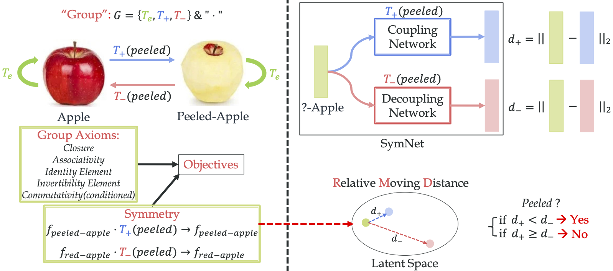

# SymNet
As a part of [HAKE](http://hake-mvig.cn/) project (HAKE-Object).

This is the code accompanying the CVPR2020 paper: Symmetry and Group in Attribute-Object Compositions. [[Arxiv](url)]

*Yong-Lu Li, Yue Xu, Xiaohan Mao, Cewu Lu*

If you find this repository useful for you, please consider citing our paper.

	@article{
	}

## Prerequisites

**Packages**: Install using `pip install -r requirements.txt`

**Datasets**: Download and re-arrange with:
	
	cd data; bash download_data.sh

**Features and pretrained models**: Features for compositional ZSL (CZSL) setting[1] will be downloaded together with the datasets. Features for generalized compositional ZSL (GCZSL) setting[2] can be extracted using:

	python utils/dataset/GCZSL_dataset.py [MIT/UT]

Pretrained models and intermediate results can be downloaded from [here](url). Please unzip the `obj_scores.tar` to `./data/obj_scores` and `weights.tar` to `./weights`.

## Compositional Zero-shot Leaning (CZSL)

These are commands for the split and evaluation metrics introduced by [1].

### Training a object classifier

Before training a SymNet model, train an object classifier by running:

	python run_symnet.py --network fc_obj --name MIT_obj_lr3e-3 --data MIT --epoch 1500 --batchnorm --lr 3e-3
	python run_symnet.py --network fc_obj --name UT_obj_lr1e-3 --data UT --epoch 300 --batchnorm --lr 1e-3

Then store the intermediate object results:

	python test_obj.py --network fc_obj --name MIT_obj_lr3e-3 --data MIT --epoch 1120 --batchnorm
	python test_obj.py --network fc_obj --name UT_obj_lr1e-3 --data UT --epoch 140 --batchnorm

The results file will be stored in `./data/obj_scores` with names `MIT_obj_lr3e-3_ep1120.pkl` and `UT_obj_lr1e-3_ep140.pkl` (in the examples above).

### Training a SymNet

To train a SymNet with the hyper-parameters in our paper, run:

	python run_symnet.py --name MIT_best --data MIT --epoch 400 --obj_pred MIT_lr3e-3_ep1120.pkl --batchnorm --lr 5e-4 --bz 512 --lambda_cls_attr 1 --lambda_cls_obj 0.01 --lambda_trip 0.03 --lambda_sym 0.05 --lambda_axiom 0.01
	python run_symnet.py --name UT_best --data UT --epoch 700 --obj_pred UT_lr1e-3_ep140.pkl --batchnorm  --wordvec onehot  --lr 1e-4 --bz 256 --lambda_cls_attr 1 --lambda_cls_obj 0.5 --lambda_trip 0.5 --lambda_sym 0.01 --lambda_axiom 0.03

### Model Evaluation

	python test_symnet.py --name MIT_best --data MIT --epoch 320 --obj_pred MIT_lr3e-3_ep1120.pkl --batchnorm
	python test_symnet.py --name UT_best --data UT --epoch 600 --obj_pred UT_lr1e-3_ep140.pkl --wordvec onehot --batchnorm

## Generalized Compositional Zero-shot Leaning (GCZSL)

These are commands for the split and evaluation metrics introduced by [2].

### Training a object classifier

	python run_symnet.py --network fc_obj --data MITg --name MITg_obj --bz 2048 --lr 3e-3 --epoch 1000 --dropout 0.7  --fc_cls 1024

To store the object classification results of both valid and test set, run:

	python test_obj.py --network fc_obj --data MITg --name MITg_obj --epoch 605 --dropout 0.7 --fc_cls 1024 --test_set test
	python test_obj.py --network fc_obj --data MITg --name MITg_obj --epoch 605 --dropout 0.7 --fc_cls 1024 --test_set val

### Trainig a SymNet
To train a SymNet with the hyper-parameters in our paper, run:

	python run_symnet_gczsl.py --data MITg --name MITg_best --epoch 400 --obj_pred MITg_obj_val_ep605.pkl --test_set val --rmd_metric rmd --lr 5e-4 --bz 512 --batchnorm  --lambda_cls_attr 1 --lambda_cls_obj 0.01 --lambda_trip 0.03 --lambda_sym 0.05 --lambda_axiom 0.01 --test_freq 5

### Model Evaluation

	python test_symnet_gczsl.py --data MITg --name MITg_best --epoch 380 --obj_pred MITg_obj_val_ep605.pkl --batchnorm --test_set val --topk 1
	python test_symnet_gczsl.py --data MITg --name MITg_best --epoch 380 --obj_pred MITg_obj_test_ep605.pkl --batchnorm --test_set test --topk 1

## Acknowledgement
The dataloader and evaluation code are based on [Attributes as Operators](https://github.com/Tushar-N/attributes-as-operators)[1] and [Task-Driven Modular Networks](https://github.com/facebookresearch/taskmodularnets)[2].

## Reference

[1] [Attributes as Operators: Factorizing Unseen Attribute-Object Compositions](https://arxiv.org/abs/1803.09851)

[2] [Task-Driven Modular Networks for Zero-Shot Compositional Learning](https://arxiv.org/abs/1905.05908)